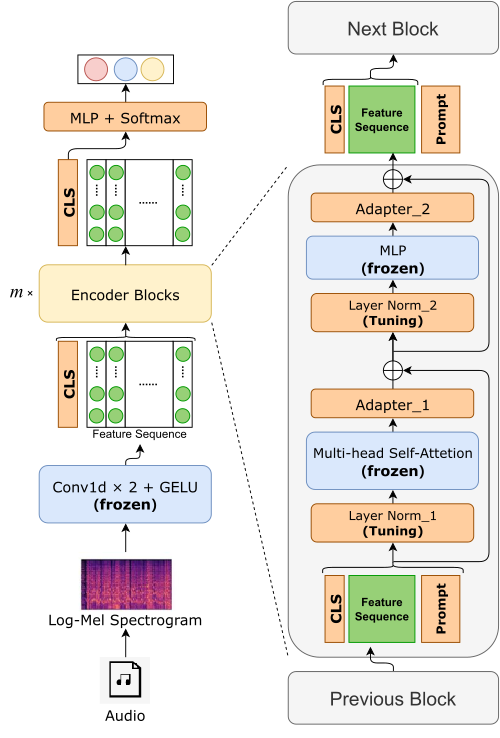

# WhisPAr
The code and data of "WhisPAr: Transferring Pre-trained Audio Models to Fine-grained Classification via Prompt and Adapter" ([paper](https://doi.org/10.1016/j.knosys.2024.112242))

In this paper, we propose a new audio classification method named WhisPAr, which works well on fine-grained tasks. WhisPAr is based on the pre-trained ASR model [Whisper](https://arxiv.org/abs/2212.04356) and realizes parameter-efficient transfer learning via Prompt and Adapter. We tested our method on 3 fine-grained audio classification tasks and achieved SOTA performance. Our method is effective and generally applicable, which has the potential to be used in more powerful audio pre-trained models in the future.  

  

## Datasets
In this paper, we conducted experiments on three fine-grained tasks in total, including:  
+ COG (`./datasets/COG`) is a Chinese Opera Genre Data Set (COG) collected in a pre-experimental stage, which contains 12,000 samples evenly distributed across 6 opera genres.  
+ [Audio Emotions](https://www.kaggle.com/datasets/uldisvalainis/audio-emotions/) (`./data/Emotions`) integrates data from 4 datasets commonly used in audio sentiment analysis researches, including RAVDESS, CREMA-D, SAVEE, and TESS, for a total of 7 sentiment categories and 12,798 samples.  
+ [BirdCLEF 2022](https://www.kaggle.com/competitions/birdclef-2022/) (`./data/Bird`) is derived from the Cornell Lab of Ornithology competition held on the Kaggle platform in 2022, and contains 152 bird classes with 14,657 samples.  
+ Due to file size, the divided training set, test set, and validation set can be downloaded [here](https://njuedu-my.sharepoint.cn/:f:/g/personal/522022140097_365_nju_edu_cn/EhOOW6q6GYNCpn6fTJS-hf0BZ2l20Ekmjn4LKR8dmQNtHw?e=aLmt3H).  
+ You can also experiment on your own dataset after splitting it into training set, test set and validation set, and putting the files under the directory `./data/XXX/`. Audio files in various formats (`.mp3`, `.wav`, `.ogg`, etc.) are supported, but the data should be organized as follows:

```
    ─data  
      ├─test  
      │  ├─0  
      │  │  audio-0-0.mp3  
      │  │  audio-0-1.mp3  
      │  │  ...  
      │  ├─1  
      │  │  audio-1-0.mp3  
      │  │  ...  
      │  ├─2  
      │  └─...  
      │  
      ├─train  
      │  └─...  
      │  
      └─valid  
          └─...  
```
## Running
1. Install the requirements from the `./requirements.txt`
2. Run the `./01_preprocess.py` to convert the audio sample to log-Mel spectrograms and store it as a `.pkl` file.
3. Run the `./02_train.py` to train WhisPAr and evaluate it on the valid set.
4. Run the `./03_test.py` to evaluate WhisPAr on the test set and save the results.
5. You may need to change the hyperparameters if necessary.

## Hyperparameters
You may need to change the hyperparameters in `./01_preprocess.py`, `./02_train.py` and `./03_test.py` for best performance according to your tasks. And here comes the expression of some important hyperparameters.  
+ _data\_dir_: the directory name of your datasets. You should put your data under the directory `./data/data_name/`.  
+ _cls\_num_: the number of category in your datasets.  
+ _audio\_len_: the uniform duration to which an audio file is compressed/padded. Due to the limitations of the pre-trained Whisper, no more than 30s is allowed. Default to 30.  
+ _prompt\_len_: the length of the Prompt sequence added to each Whisper Block. Default to 2.   
+ _bottleneck\_dim_: the bottleneck size of Adapter modules injected to Whisper. Default to 16.   
+ _adapt\_list_: which Whisper Blocks to inject Adapter modules into. For example, `[0,1,2]` means that the Adapters are added to the first three blocks, while the remainder is left unchanged. Default to None, which means that all blocks are adapted.  
+ _bs\_train_ & _bs\_eval_: The sample size contained in a batch when training or evaluating. Default to 16.  
+ _epochs_: Total training epochs.  Default to 100.  
+ _lr_: Preset learning rate. Default to 0.001.  
+ _warmup\_step_: Step of warm-up strategy. Default to 10000.  

## Reference  
+ [https://github.com/openai/whisper](https://github.com/openai/whisper)  
+ [https://www.kaggle.com/datasets/uldisvalainis/audio-emotions](https://www.kaggle.com/datasets/uldisvalainis/audio-emotions/)  
+ [https://www.kaggle.com/competitions/birdclef-2022](https://www.kaggle.com/competitions/birdclef-2022/)  

## Citation  
If you find this work useful, please kindly consider citing the paper:  
```
@article{SHI2024112242,
    title = {WhisPAr: Transferring pre-trained audio models to fine-grained classification via Prompt and Adapter},
    journal = {Knowledge-Based Systems},
    volume = {300},
    pages = {112242},
    year = {2024},
    issn = {0950-7051},
    doi = {https://doi.org/10.1016/j.knosys.2024.112242},
    url = {https://www.sciencedirect.com/science/article/pii/S0950705124008761},
    author = {Bin Shi and Hao Wang and Chenchen Lu and Meng Zhao},
    keywords = {Audio classification, Transfer learning, Prompt paradigm, Adapter, Whisper},
    abstract = {With the rise of Transformer as the backbone networks, pre-trained models have gradually become a hot spot in deep learning–related fields and play an important role in increasing research and production activities. However, current pre-trained models still have the problems of coarse knowledge granularity and poor zero/few-shot performance and cannot be well applied to fine-grained downstream tasks. In audio processing, considerable structure biases exist between the upstream and downstream tasks, making it difficult to realize cross-task transfer learning. Inspired by the success of Prompt and Adapter techniques in natural language processing (NLP) and computer vision (CV), we propose a cross-task transfer method with good generality to address these problems. We contribute the following: (1) a novel transfer method for audio pre-trained models via deep Prompt and Adapter structures to improve model adaptation to downstream tasks, which is effective and generally applicable and has potential to be used in more powerful audio pre-trained models in the future; (2) a fine-grained classification model implementation based on the abovementioned method WhisPAr, which is experimentally shown to outperform the baseline models in various fine-grained classification tasks (0.73 vs. 0.84, 0.76 vs. 0.81, and 0.47 vs. 0.68); and (3) an in-depth exploration of the mechanisms and laws of Prompt and Adapter. These contributions are expected to drive future research on audio processing and transfer learning, among others.}
}
```
